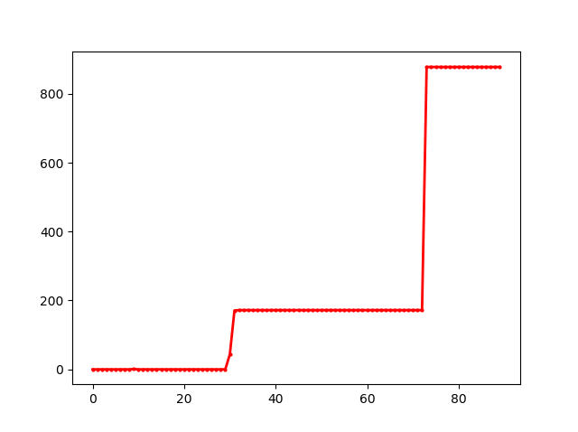

# Super Mario Neuro-Evolution Implementation in Python

This is inspired by mx0c: https://github.com/mx0c/super-mario-python

## Setup

### 1. Install Torch

Here's how to install torch: https://pytorch.org/
I reccomend installing it with conda.

### 2. Install Dependencies

* $ pip install -r requirements.txt

## Standalone windows build

* $ pip install py2exe
* $ python compile.py py2exe

## Controls

## Current state:

